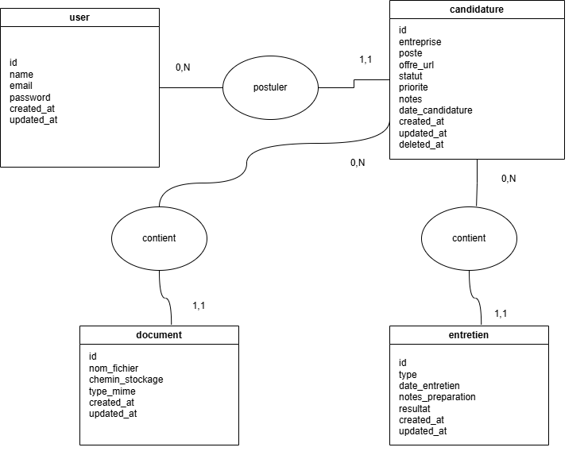
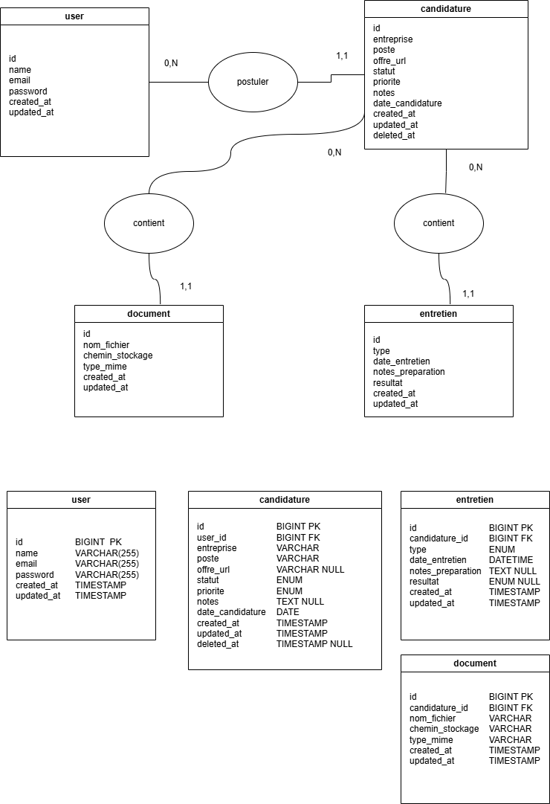
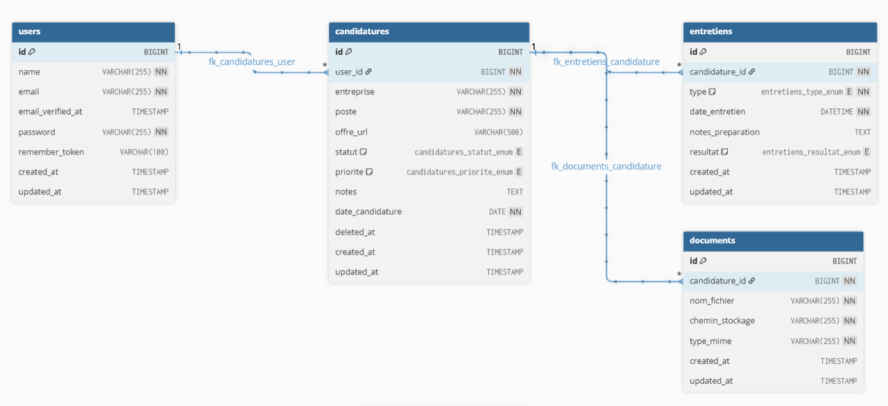
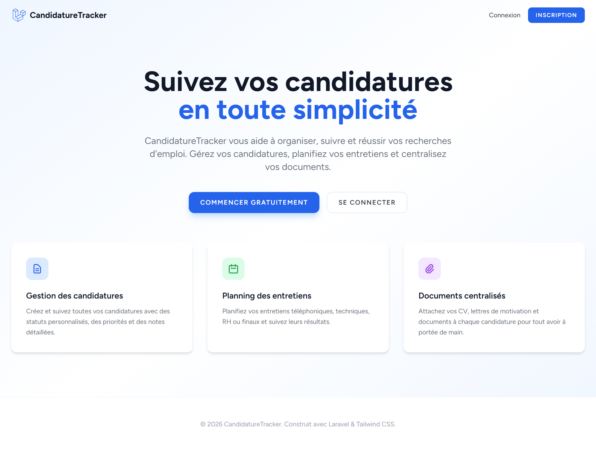
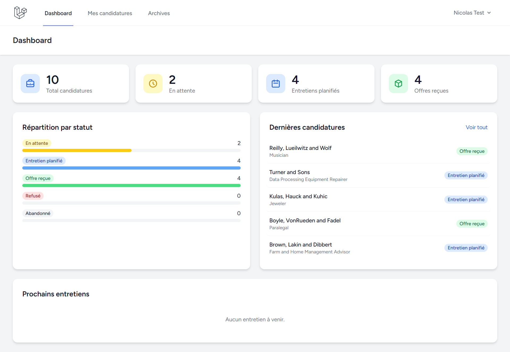
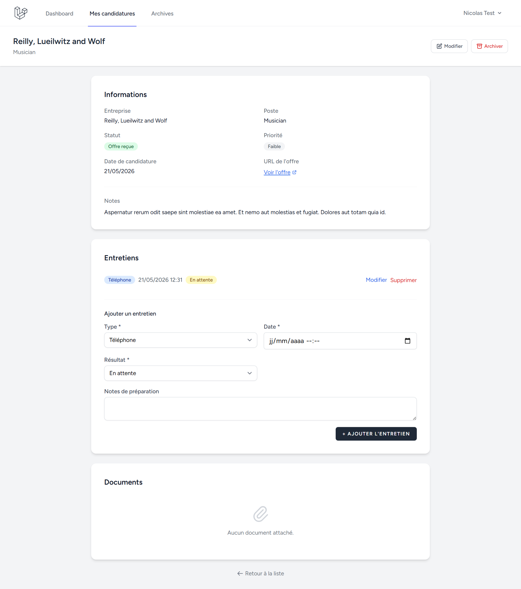
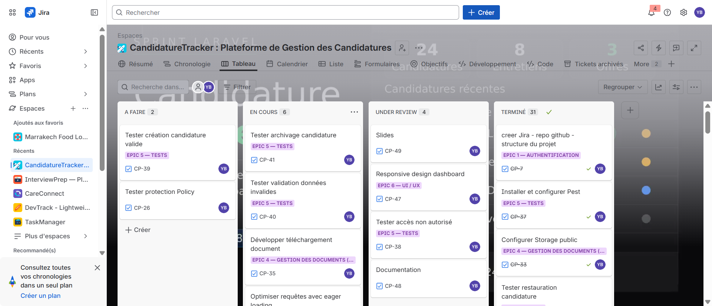

# CandidatureTracker — Suivi de candidatures

## Overview

**CandidatureTracker** is a job application tracking platform built with **Laravel**.

It helps job seekers organize their applications, schedule interviews, and centralize documents — replacing scattered spreadsheets, notes, and email attachments.

The platform follows Laravel best practices using:

- MVC Architecture
- Eloquent ORM
- Blade templating
- Named routes
- Middleware authentication
- Policy-based authorization
- Form Requests validation
- Soft Deletes

---

# 🚀 Features

# 🔐 Authentication

Users can:

- Register securely
- Login securely
- Logout securely

Authentication is powered by Laravel Breeze.

---

# 📋 Candidature Management

Users can:

- Create candidatures
- Edit candidatures
- View candidature details
- Archive candidatures (soft delete)
- Restore archived candidatures
- Permanently delete archived candidatures
- Filter candidatures by status and priority

Each candidature includes:

- Entreprise
- Poste
- Offre URL
- Statut
- Priorité
- Notes
- Date de candidature

## Statut values

| Value | Label |
|---|---|
| `to_review` | En attente |
| `interview_scheduled` | Entretien planifié |
| `offer_received` | Offre reçue |
| `rejected` | Refusé |
| `abandoned` | Abandonné |

## Priorité values

| Value | Label |
|---|---|
| `high` | Haute |
| `medium` | Moyenne |
| `low` | Faible |

## Accessors

- `statut_label` — Transforms status codes into human-readable French labels
- `priorite_label` — Transforms priority codes into human-readable French labels

---

# 📅 Interview Tracking

Users can:

- Add interviews to a candidature
- Edit interviews
- Delete interviews
- Track interview results

Each interview includes:

- Type
- Date
- Notes de préparation
- Résultat

## Type values

| Value | Label |
|---|---|
| `telephone` | Téléphone |
| `technique` | Technique |
| `rh` | RH |
| `final` | Final |

## Résultat values

| Value | Label |
|---|---|
| `pending` | En attente |
| `positive` | Positif |
| `negative` | Négatif |

## Accessors

- `type_label` — Transforms type codes into French labels
- `resultat_label` — Transforms result codes into French labels

---

# 📎 Document Management

Users can:

- Upload documents when creating or editing a candidature
- Download uploaded documents
- Delete documents

Each document includes:

- Nom du fichier
- Chemin de stockage
- Type MIME

---

# 🛠 Installation

### Prerequisites

- PHP 8.3+
- Composer
- Node.js + NPM
- MySQL
- XAMPP / Laragon / WAMP

### Installation Steps

1. Clone the repository

```bash
git clone https://github.com/BEN-ESSAHRAOUI-Yassine/candidaturetracker.git
cd candidaturetracker
```

2. Install dependencies

```bash
composer install
npm install
```

3. Environment configuration

```bash
cp .env.example .env
php artisan key:generate
```

4. Configure database

Edit `.env`:

```ini
DB_CONNECTION=mysql
DB_HOST=127.0.0.1
DB_PORT=3306
DB_DATABASE=candidaturetracker
DB_USERNAME=root
DB_PASSWORD=
```

5. Run migrations and seeders

```bash
php artisan migrate:fresh --seed
```

6. Create storage link

```bash
php artisan storage:link
```

7. Compile frontend assets

```bash
npm run build
```

8. Start server

```bash
php artisan serve
```

Visit:

```
http://127.0.0.1:8000
```

---

# 📁 File Storage

Documents are stored using Laravel's **Storage** facade with the **public** disk:

```php
$path = $request->file('document')->store('documents', 'public');
```

- **Storage path:** `storage/app/public/documents/`
- A symbolic link `public/storage → storage/app/public` is required
- Downloads are served via `Storage::disk('public')->download($path, $name)`
- Physical files are automatically deleted when a document record is removed

Run the following command to create the storage link:

```bash
php artisan storage:link
```

---

# 🧪 Testing (Pest)

The project uses **Pest PHP** — an elegant testing framework built on top of PHPUnit.

### Why Pest?

- **Cleaner syntax:** Write tests with functions instead of classes
- **Expressive:** `test('name', fn() => ...)` reads like plain English
- **Laravel integration:** `pestphp/pest-plugin-laravel` provides seamless Laravel helpers
- **Built-in features:** `RefreshDatabase`, `assertSee()`, `assertRedirect()` and more
- **Fast feedback:** Run tests with a single command

### Configuration

Pest is configured in `tests/Pest.php`:

```php
pest()->extend(TestCase::class)
    ->use(RefreshDatabase::class)
    ->in('Feature');
```

- All tests inside `tests/Feature/` automatically refresh the database
- The `phpunit.xml` file uses an **SQLite in-memory database** for testing

### Writing a new test

Create a file in `tests/Feature/` or `tests/Unit/`:

```php
<?php

use App\Models\Candidature;
use App\Models\User;

test('a user can view their candidatures', function () {
    $user = User::factory()->create();
    Candidature::factory()->count(3)->create(['user_id' => $user->id]);

    $response = $this->actingAs($user)->get(route('candidatures.index'));

    $response->assertOk();
    $response->assertSee('Mes candidatures');
});
```

Run all tests with:

```bash
php artisan test
```

Run a specific file:

```bash
php artisan test tests/Feature/CandidatureTest.php
```

Run with coverage (requires Xdebug or PCOV):

```bash
php artisan test --coverage
```

---

# 📊 Analytics Dashboard

The dashboard provides an overview of the user's job search progress:

- **Total candidatures** — Number of all active candidatures
- **En attente** — Candidatures waiting for review
- **Entretiens planifiés** — Candidatures with scheduled interviews
- **Offres reçues** — Candidatures that received an offer
- **Répartition par statut** — Visual bar chart of status distribution
- **Dernières candidatures** — Recently created candidatures
- **Prochains entretiens** — Upcoming interviews sorted by date

Each stat card links to the corresponding filtered candidature list.

---

# 🗄 Archives & Soft Deletes

Candidatures are soft-deleted when archived:

- **Archive:** Soft deletes the candidature (preserves data)
- **Restore:** Recovers an archived candidature
- **Force delete:** Permanently removes the candidature and all related data

Policy authorization ensures only the owner can archive, restore, or force-delete.

---

# 🛣 Routing System

| Method | Route | Controller | Action |
|---|---|---|---|
| GET | `/dashboard` | `CandidatureController` | `dashboardStats` |
| GET | `/candidatures` | `CandidatureController` | `index` |
| GET | `/candidatures/create` | `CandidatureController` | `create` |
| POST | `/candidatures` | `CandidatureController` | `store` |
| GET | `/candidatures/{candidature}` | `CandidatureController` | `show` |
| GET | `/candidatures/{candidature}/edit` | `CandidatureController` | `edit` |
| PUT | `/candidatures/{candidature}` | `CandidatureController` | `update` |
| DELETE | `/candidatures/{candidature}` | `CandidatureController` | `destroy` |
| GET | `/archives` | `CandidatureController` | `archives` |
| PATCH | `/candidatures/{id}/restore` | `CandidatureController` | `restore` |
| DELETE | `/candidatures/{id}/force-delete` | `CandidatureController` | `forceDestroy` |
| POST | `/candidatures/{candidature}/entretiens` | `EntretienController` | `store` |
| GET | `/entretiens/{entretien}/edit` | `EntretienController` | `edit` |
| PUT | `/entretiens/{entretien}` | `EntretienController` | `update` |
| DELETE | `/entretiens/{entretien}` | `EntretienController` | `destroy` |
| GET | `/documents/{document}/download` | `DocumentController` | `download` |
| DELETE | `/documents/{document}` | `DocumentController` | `destroy` |

---

# 🗄 Database Design

## Tables

- `users`
- `candidatures`
- `entretiens`
- `documents`

## Relationships

- **User → Candidatures:** One user has many candidatures (`hasMany`)
- **Candidature → Entretiens:** One candidature has many interviews (`hasMany`)
- **Candidature → Documents:** One candidature has many documents (`hasMany`)
- **Entretien → Candidature:** One interview belongs to one candidature (`belongsTo`)
- **Document → Candidature:** One document belongs to one candidature (`belongsTo`)

## Soft Deletes

- `candidatures` uses `SoftDeletes` trait

## MCD



## MLD



## DB Diagram



---

# 📌 Laravel Concepts Used

### Policies

Used for candidature authorization:

- Ownership verification (`user_id` match)
- `view`, `create`, `update`, `delete`, `restore`, `forceDelete`

### Form Requests

Used for validation:

- `StoreCandidatureRequest` — Validation rules for creating candidatures
- `UpdateCandidatureRequest` — Validation rules for updating candidatures
- `StoreEntretienRequest` — Validation rules for creating interviews
- `UpdateEntretienRequest` — Validation rules for updating interviews

### Soft Deletes

Candidatures are archived instead of permanently deleted, with the option to force-delete.

### Accessors

- `statut_label`, `priorite_label` (Candidature)
- `type_label`, `resultat_label` (Entretien)

### Named Routes

All routes are named for clean Blade references.

### Route Model Binding

Models are automatically resolved in route parameters.

---

# 🔒 Security Measures

The application implements several Laravel security best practices:

- Authentication middleware
- Password hashing
- CSRF protection
- Form Request validation
- Policy-based authorization
- Route model binding
- Protected routes

---

# 🛠 Technologies Used

- **Laravel 13**
- **PHP 8.3+**
- **MySQL**
- **Blade**
- **Eloquent ORM**
- **Laravel Breeze**
- **Tailwind CSS**
- **Vite**
- **Laravel Policies**
- **Laravel Form Requests**
- **Pest PHP**

---

# 🐞 Debugging Tools

### Laravel Debugbar

Used to:

- Detect N+1 queries
- Monitor SQL queries
- Analyze performance

### Laravel Telescope

Access at `/telescope`

Used to:

- Inspect requests
- View exceptions
- Monitor queries
- Debug authorization

---

# 📁 Directory Structure

```text
app/
├── Http/
│   ├── Controllers/
│   │   ├── CandidatureController.php
│   │   ├── EntretienController.php
│   │   └── DocumentController.php
│   └── Requests/
│       ├── StoreCandidatureRequest.php
│       ├── UpdateCandidatureRequest.php
│       ├── StoreEntretienRequest.php
│       └── UpdateEntretienRequest.php
├── Models/
│   ├── Candidature.php
│   ├── Entretien.php
│   └── Document.php
└── Policies/
    └── CandidaturePolicy.php

database/
├── factories/
│   ├── CandidatureFactory.php
│   ├── EntretienFactory.php
│   ├── DocumentFactory.php
│   └── UserFactory.php
├── migrations/
└── seeders/

resources/views/
├── layouts/
├── auth/
├── candidatures/
├── entretiens/
├── components/
├── dashboard.blade.php
└── welcome.blade.php

routes/
└── web.php

tests/
├── Pest.php
├── TestCase.php
├── Unit/
└── Feature/
```

---

# 📋 [Jira Board](https://ybenessahraoui.atlassian.net/jira/software/projects/CP/boards/233?atlOrigin=eyJpIjoiNmM3NWIxOGQ5YWQ5NGY5Mjg2Yzk2ZmI2ZWNjMjQ2NGYiLCJwIjoiaiJ9)

---

# 📋 [Presentation Link](https://docs.google.com/presentation/d/1OXLGoBm2oxmISfxfBmM8gGX8-skqB0mr_xJov0Z1h20/view?usp=sharing)

---

# 📸 Screenshots

## welcome Page



## Login Page


## Dashboard



## Candidature Details



## Jira board


